- [Livrables](#livrables)

- [Échéance](#%c3%89ch%c3%a9ance)

- [Quelques éléments à considérer](#quelques-éléments-à-considérer-pour-les-parties-2-et-3-)

- [Travail à réaliser](#travail-%c3%a0-r%c3%a9aliser)

# Sécurité des réseaux sans fil

## Laboratoire 802.11 Sécurité WPA Entreprise

__A faire en équipes de deux personnes__

### Objectif :

1.	Analyser les étapes d’une connexion WPA Entreprise avec une capture Wireshark
2.	Implémenter une attaque WPE (Wireless Pwnage Edition) contre un réseau WPA Entreprise


## Quelques éléments à considérer pour les parties 2 et 3 :

Les parties 2 et 3 nécessitent du matériel particulier. Si vous avez travaillé jusqu'ici avec l'interface WiFi interne de votre laptop, il y a des fortes probabilités qu'elle puisse aussi être utilisée pour les attaques Entreprise. Cela dépendra de la capacité de votre interface d'être configurée en mode AP. Ces attaques ne fonctionnent pas avec toutes les interfaces Alfa. Il faudra utiliser le bon modèle.

En principe, il devrait être possible de démarrer vos machines en Kali natif (à partir d'une clé USB, avec une distro live par exemple) ou d'employer une autre version de Linux si vous voulez utiliser votre propre interface 

## Voici quelques informations qui peuvent vous aider :

- Solution à l’erreur éventuelle « ```Could not configure driver mode``` » :

```
nmcli radio wifi off
rfkill unblock wlan
```
-	Pour pouvoir capturer une authentification complète, il faut se déconnecter d’un réseau et attendre 1 minute (timeout pour que l’AP « oublie » le client) 
-	Les échanges d’authentification entreprise peuvent être facilement trouvés utilisant le filtre d’affichage « ```eap``` » dans Wireshark
-   Il est __impératif__ de bien fixer le cannal lors de vos captures


## Travail à réaliser

### 1. Analyse d’une authentification WPA Entreprise

Dans cette première partie (la moins fun du labo...), vous allez capturer une connexion WPA Entreprise au réseau de l’école avec Wireshark et fournir des captures d’écran indiquant dans chaque capture les données demandées.

A tittre d'exemple, voici [une connexion WPA Entreprise](files/auth.pcap) qui contient tous les éléments demandés. Vous pouvez utiliser cette capture comme guide de ce que la votre doit contenir. Vous pouvez vous en servir pour votre analyse __comme dernière ressource__ si vos captures ne donnent pas le résultat désiré ou s'il vous manquent des éléments importants dans vos tentatives de capture.

Pour réussir votre capture, vous pouvez procéder de la manière suivante :

- 	Identifier l'AP le plus proche, en identifiant le canal utilisé par l’AP dont la puissance est la plus élevée (et dont le SSID est HEIG-VD...). Vous pouvez faire ceci avec ```airodump-ng```, par exemple
-   Lancer une capture avec Wireshark
-   Etablir une connexion depuis un poste de travail (PC), un smartphone ou n'importe quel autre client WiFi. __Attention__, il est important que la connexion se fasse à 2.4 GHz pour pouvoir sniffer avec les interfaces Alfa
- Comparer votre capture au processus d’authentification donné en théorie (n’oubliez pas les captures d'écran pour illustrer vos comparaisons !). En particulier, identifier les étapes suivantes :
	- Requête et réponse d’authentification système ouvert
 	- Requête et réponse d’association (ou reassociation)
	- Négociation de la méthode d’authentification entreprise (TLS?, TTLS?, PEAP?, LEAP?, autre?)
	- Phase d’initiation
	- Phase hello :
		- Version TLS
		- Suites cryptographiques et méthodes de compression proposées par le client et acceptées par l’AP
		- Nonces
		- Session ID
	- Phase de transmission de certificats
	 	- Echanges des certificats
		- Change cipher spec
	- Authentification interne et transmission de la clé WPA (échange chiffré, vu par Wireshark comme « Application data »)
	- 4-way handshake

### Comparaison capture Wireshark et théorie

Certaines captures d'écran ont été prise de la capture Wireshark que nous avons effectuée, malheureusement il manque certaines parties dans celle-ci (par exemple pour les méthode d'authentifications proposées nous n'avons pas de EAP-TLS mais directement du PEAP). C'est pourquoi nous avons aussi des captures d'écran venant de la capture Wireshark fournie.

Il est a noter aussi que la communication se fait entre trois parties, du client ver l'AP et de l'AP ver le serveur d'authentification.

#### Requête et réponse d’authentification système ouvert

Les captures d'écrans de cette section sont prises depuis notre capture Wireshark.

Voici la requête envoyée par le client :

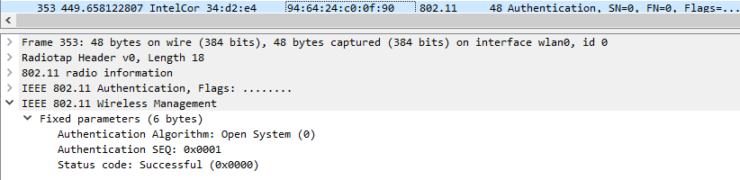

Nous pouvons voir dans l'en-tête IEEE 802.11 Wireless Management qu'il s'agit bien d'un système ouvert (champ `Authentication Algorithm`). Lorsqu'il s'agit d'une requête d'authentification le champ `Authentication SEQ` contient la valeur `0x0001`, il s'agit donc bien d'une trame allant d'un client vers l'AP.

Voici la réponse de l'AP :

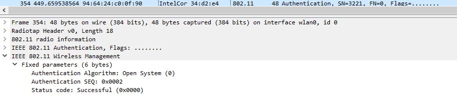

Dans l'en-tête IEEE 802.11 Wireless Management nous pouvons voir cette fois-ci qu'il s'agit de la séquence numéro 2, il s'agit donc d'une réponse à une requête. La trame vient bien d'un AP en direction d'un client ayant fait une requête.

#### Requête et réponse d’association (ou reassociation)

Les captures d'écrans de cette section sont prises depuis notre capture Wireshark.

Voici la requête envoyée par le client :

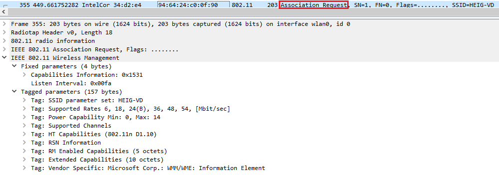

Nous pouvons voir dans l'encadré rouge qu'il s'agit bien d'une requête d'association.
Dans l'en-tête IEEE 802.11 Wireless Management on peut voir différents champs dont celui contenant le SSID de l'AP (ici `HEIG-VD`). Le reste des informations concernent les différentes propriétés que supporte le client (débit, channels, etc...).

Voici la réponse envoyée par l'AP :

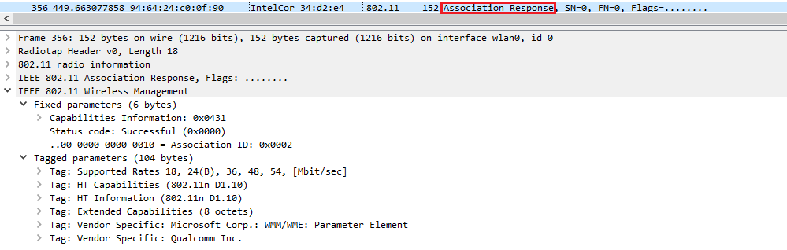

Ici l'encadré rouge montre qu'il s'agit d'une réponse d'association. Dans l'en-tête IEEE 802.11 Wireless Management on peut voir le status code à `Successful`, ce qui nous montre que l'association a été réussie. Juste en dessous nous pouvons voir l'`Association ID` qui est un ID lié au client (ici `0x0002`). Le reste des paramètres sont les différentes propriétés supportées par l'AP.

Nous pouvons noter que pour l'authentification et pour l'association le protocole utilisé est 802.11. Maintenant nous avons terminé la séquence du système ouvert. Nous allons passer à la négociation d'authentification entreprise.

#### Négociation de la méthode d’authentification entreprise

Pour cette partie nous avons eu quelques soucis avec notre capture Wireshark, en effet nous n'avons pas le même déroulement que dans la capture Wireshark d'exemple. Dans la capture d'exemple l'AP propose d'abord d'utiliser la méthode `EAP-TLS`, cette trame n'existe pas dans notre capture, il nous est directement proposé d'utiliser `EAP-PEAP`. C'est pourquoi les captures présentes dans cette section proviennent de la capture Wireshark d'exemple.

Afin de faire la négociation d'authentification, l'AP va envoyer une trame en définissant la méthode qu'il souhaite utiliser. Le client aura la liberté d'accepter (en envoyant un `ACK`) ou alors de refuser (en envoyer un `NACK`) la méthode. Si le client refuse la méthode, l'AP proposera une autre méthode au client et on recommence le même processus.

Voici la trame qu'envoie l'AP :

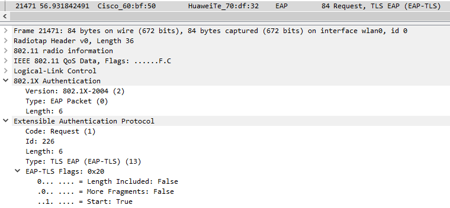

Nous pouvons voir qu'ici l'AP fait une request au client pour lui proposer d'utiliser l'authentification `EAP-TLS`. On peut voir que la méthode proposée est encapsulée dans EAP (qui est 802.1X).

Voici la trame qu'envoie le client :

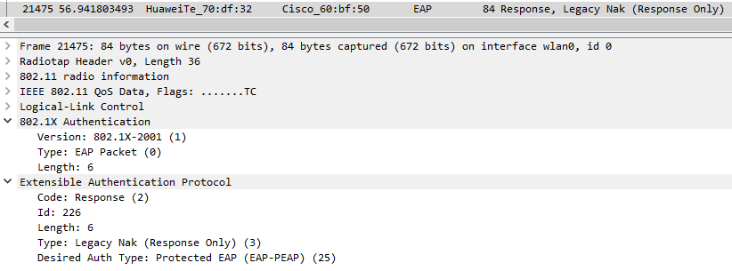

On peut voir que le client envoie un `Nak` car il refuse d'utiliser cette méthode. Il renseigne dans le champ `Desired Auth Type` la méthode d'authentification qu'il souhaite utiliser. Ici il s'agit de la méthode `EAP-PEAP`.

Donc l'AP va ensuite envoyer une nouvelle trame avec la méthode demandée par le client :

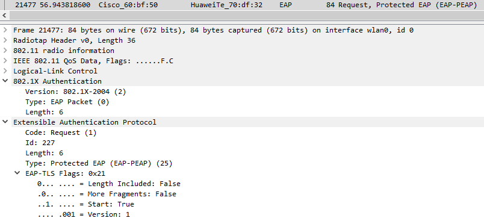

Les messages de la négociation utilisent tous le protocole EAP (802.11x).

#### Phase d’initiation

Les captures d'écrans de cette section sont prises depuis notre capture Wireshark.

Dans la phase d'initiation, le client envoie dans un premier temps un paquet EAPOL `start` :

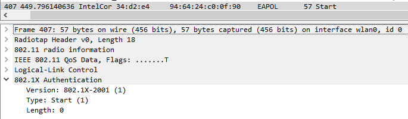

Ce paquet va permettre d'initier le processus d'authentification. Ensuite l'AP va demander au client de déclarer son identité en utilisant un paquet `request` ayant comme type `Identity` :

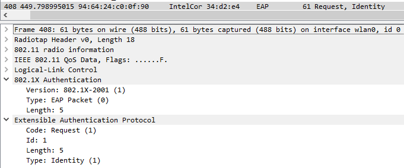

Puis le client va ensuite envoyer un paquet `Response` avec le type `Identity` :

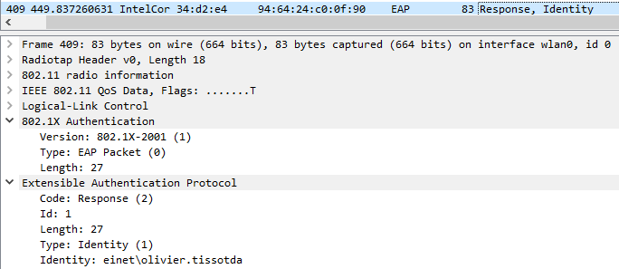

Nous pouvons voir dans ce paquet qu'une identité est fournie, ici il s'agit de `einet\olivier.tissotda`. Ensuite l'AP pourra communiquer avec un serveur d'authentification (RADIUS par exemple) afin de faire un Access-Request. La prochaine étape va être l'établissement d'un tunnel TLS.

#### Phase hello TLS

Afin de mettre en place le tunnel TLS, dans un premier temps, le client va envoyer une trame `hello` à l'AP, ce message sera transmis au serveur d'authentification.

Voici à quoi ressemble la trame `Client Hello` :

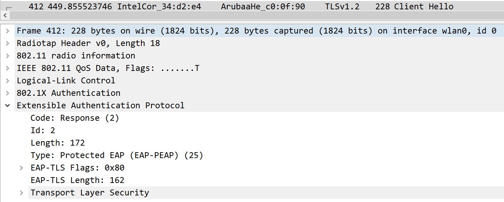

On peut voir qu'elle a une en-tête `EAP` de type `EAP-PEAP` et qu'elle comporte une partie `Transport Layer Security`.
Voici le contenu de la partie `TLS` :

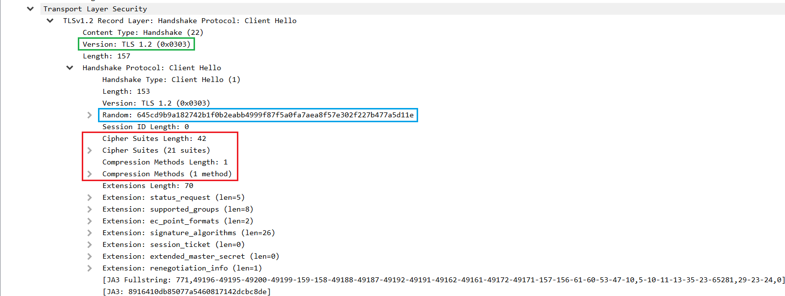

Le serveur d'authentification va répondre au client avec un message TLS `Server Hello`. Ce message est envoyé en plusieurs fragments `EAP-PEAP`, cela est nécessaire car un message EAP à une taille limite et les certificats qui sont envoyés sont assez gros. Ce message est composé de différentes parties comme le `Server Hello`, le `Certificate`, le `Server Key Exchange` et le `Server Hello Done`.

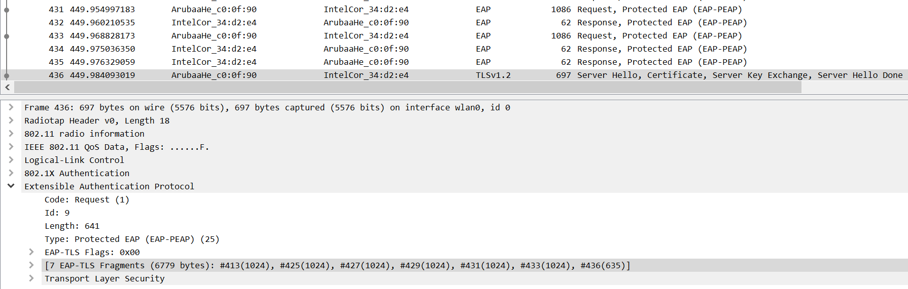

On peut voir en haut de la capture les différents paquets `EAP-PEAP` envoyés par le serveur d'authentification. Dans le paquet TLS finale on peut voir que 7 fragments ont été envoyé pour composer le `Server Hello`. Voici le contenu du message TLS envoyé par le serveur : 

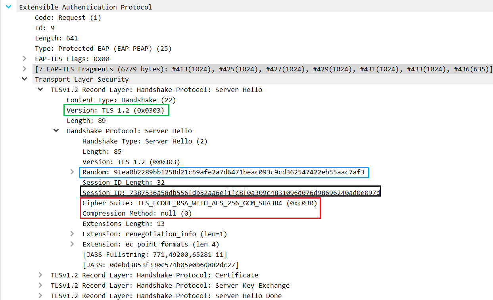

Nous pouvons maintenant identifier les différents champs demandés :

- L'encadré vert présent sur les captures de contenu montre la version TLS utilisée, ici il s'agit de `TLS 1.2`

- L'encadré bleu montre le champ `random` qui est le `nonce`, il est différent pour les deux messages

- L'encadré rouge montre le cipher suite et la méthode de compression. Dans le message du client, 21 cipher suite sont proposés et une méthode de compression est proposée. Le serveur répond au client avec un unique cipher suite et une unique méthode de compression, les deux auront été sélectionné parmis la liste proposée par le client. Dans notre cas le cipher suite est `TLS_ECDHE_RSA_WITH_AES_256_GCM_SHA384` et il n'y a pas de méthode de compression

- L'encadré noir montre le champ `Session ID`. Il n'est pas présent chez le client dans notre capture mais uniquement dans la réponse du serveur. Il est possible par moment qu'il soit présent dans le dans le `Hello` du client (dans la capture fournie c'est le cas), car le serveur peut se rappeler des clés/algorithmes qui ont été utilisés par le passé avec ce client. (https://security.stackexchange.com/questions/188495/what-is-the-session-id-parameter-indicate-in-client-hello-and-server-hello-messa)

#### Phase de transmission de certificats 

Comme dit précédement la trame envoyée par le serveur contient différentes parties. Une des parties concerne la transmission des certificats :

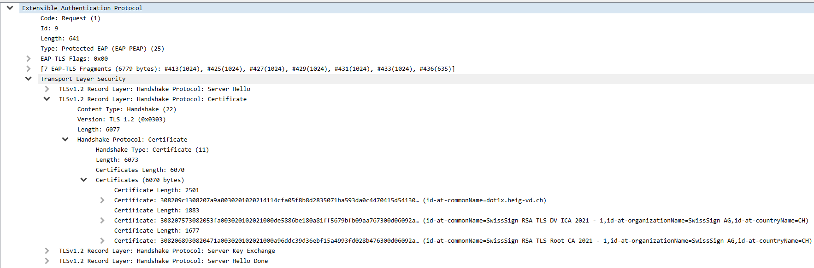

On peut voir que trois certificats sont envoyés au client. Le client répondra à cette trame avec un message `Client Key Exchange`, `Change Cipher Spec` et `Encrypted Hanshake message`. Ce message contient différentes informations, comme les paramètres pour le Diffie-Hellman.

Ensuite il y a une partie liée au `Change cipher spec`, ce message est envoyé par le client (comme mentionné avant) et par le serveur d'authentification. Ce message permet de prévenir le client/le serveur que les prochains paquets seront protégés par les paramètres venant d'être négociés (clé et cipher suite).

Voici le cipher change envoyé par le client :

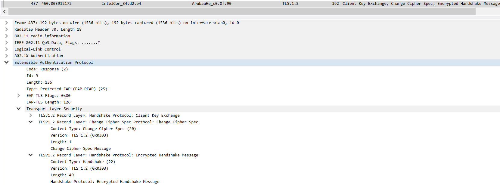

Et voici celui envoyé par le serveur :

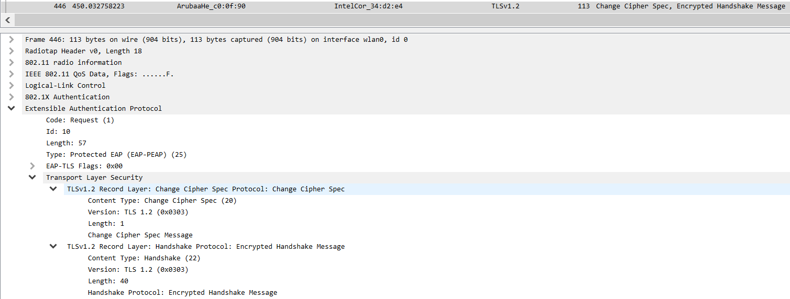

#### Authentification interne et transmission de la clé WPA

Maintenant que la connexion est sécurisée via un tunnel TLS, on va refaire une authentification via EAP comme auparavant puis on va fournir la clé WPA (MSCHAPv2). Cependant comme nous sommes dans un tunnel TLS, il n'est plus possible de voir exactement ce qu'il se passe et wireshark va afficher ces échanges sous forme de `application data` :

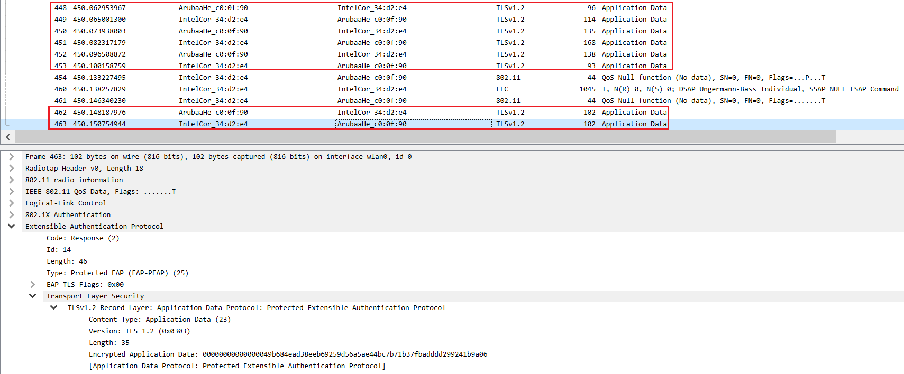

Nous pouvons voir dans les encadrés rouge les différents messages échangés dans le tunnel TLS.

A la fin de la transmission TLS, un message `Success` est envoyé au client : 

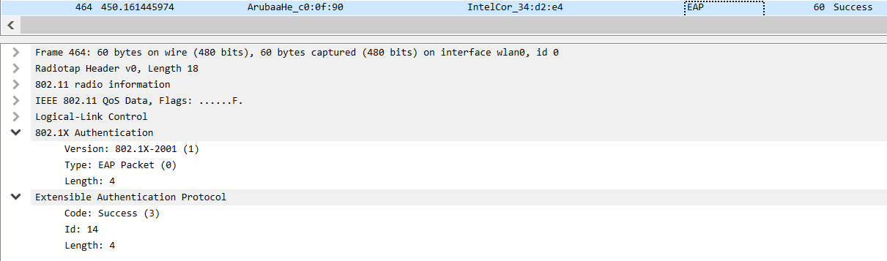

Après cela, il nous reste que la dernière étape qui concerne le 4-way handshake effectué entre le client et l'AP afin de finaliser le processus :

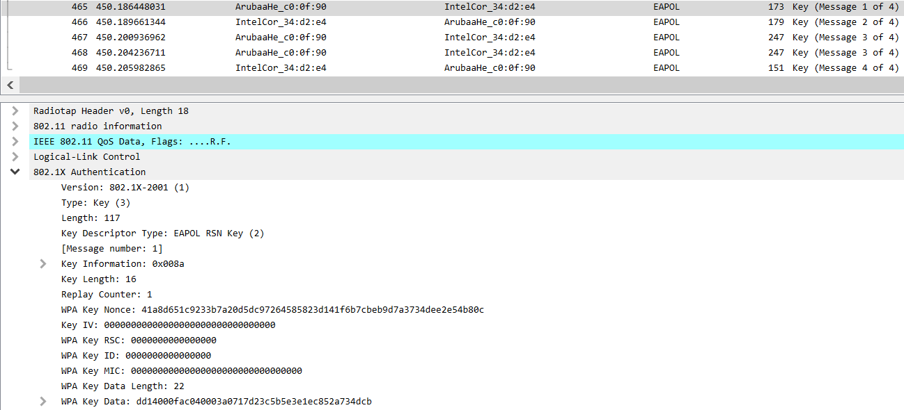

### Répondez aux questions suivantes :
 
> **_Question :_** Quelle ou quelles méthode(s) d’authentification est/sont proposé(s) au client ?
> 
> **_Réponse :_** Dans notre capture Wireshark, uniquement la méthode EAP-PEAP est proposée par l'AP mais dans la capture Wireshark d'exemple, dans un premier temps la méthode EAP-TLS est proposée puis la méthode EAP-PEAP est proposée au client.

---

> **_Question:_** Quelle méthode d’authentification est finalement utilisée ?
> 
> **_Réponse:_** La méthode EAP-PEAP est utilisée par le client dans les deux captures.

---

> **_Question:_**Arrivez-vous à voir l’identité du client dans la phase d'initiation ? Oui ? Non ? Pourquoi ?
> 
> **_Réponse:_** 

---

> **_Question:_** Lors de l’échange de certificats entre le serveur d’authentification et le client :
> 
> - a. Le serveur envoie-t-il un certificat au client ? Pourquoi oui ou non ?
> 
> **_Réponse:_**
> 
> - b. Le client envoie-t-il un certificat au serveur ? Pourquoi oui ou non ?
> 
> **_Réponse:_**
> 

---

__ATTENTION__ : pour l'utilisation des deux outils suivants, vous __ne devez pas__ configurer votre interface en mode monitor. Elle sera configurée automatiquement par l'outil en mode AP.

### 2. Attaque WPA Entreprise (hostapd)

Les réseaux utilisant une authentification WPA Entreprise sont considérés aujourd’hui comme étant très surs. En effet, puisque la Master Key utilisée pour la dérivation des clés WPA est générée de manière aléatoire dans le processus d’authentification, les attaques par dictionnaire ou brute-force utilisés sur WPA Personnel ne sont plus applicables. 

Il existe pourtant d’autres moyens pour attaquer les réseaux Entreprise, se basant sur une mauvaise configuration d’un client WiFi. En effet, on peut proposer un « evil twin » à la victime pour l’attirer à se connecter à un faux réseau qui nous permette de capturer le processus d’authentification interne. Une attaque par dictionnaire ou même par brute-force peut être faite sur cette capture, beaucoup plus vulnérable d’être craquée qu’une clé WPA à 256 bits, car elle est effectuée sur le compte d’un utilisateur.

Pour faire fonctionner cette attaque, __il est impératif que la victime soit configurée pour ignorer les problèmes de certificats__ ou que l’utilisateur accepte un nouveau certificat lors d’une connexion. Si votre connexion ne vous propose pas d'accepter le nouveau certificat, faites une recherche pour configurer votre client pour ignorer les certificats lors de l'authentification.

Pour implémenter l’attaque :

- Installer [```hostapd-wpe```](https://www.kali.org/tools/hostapd-wpe/) (il existe des versions modifiées qui peuvent peut-être faciliter la tâche... je ne les connais pas mais si vous en trouvez une qui vous rend les choses plus faciles, vous pouvez l'utiliser et nous apprendre quelque chose ! Dans le doute, utiliser la version originale...). Lire la documentation [du site de l’outil](https://github.com/OpenSecurityResearch/hostapd-wpe), celle de Kali ou d’autres ressources sur Internet pour comprendre son utilisation
- Modifier la configuration de ```hostapd-wpe``` pour proposer un réseau semblable (mais pas le même !!!) au réseau de l’école ou le réseau de votre préférence, sachant que dans le cas d'une attaque réelle, il faudrait utiliser le vrai SSID du réseau de la cible
- Lancer une capture Wireshark
- Tenter une connexion au réseau (ne pas utiliser vos identifiants réels)
- Utiliser un outil de brute-force (```john```, ```hashcat``` ou ```asleap```, par exemple) pour attaquer le hash capturé (utiliser un mot de passe assez simple pour minimiser le temps)

### Répondez aux questions suivantes :

> **_Question :_** Quelles modifications sont nécessaires dans la configuration de hostapd-wpe pour cette attaque ?
> 
> **_Réponse :_** 

---

> **_Question:_** Quel type de hash doit-on indiquer à john ou l'outil que vous avez employé pour craquer le handshake ?
> 
> **_Réponse:_** 

---

> **_Question:_** Quelles méthodes d’authentification sont supportées par hostapd-wpe ?
> 
> **_Réponse:_**


### 3. En option, vous pouvez explorer d'autres outils comme [eapeak](https://github.com/rsmusllp/eapeak) ou [crEAP](https://github.com/W9HAX/crEAP/blob/master/crEAP.py) pour les garder dans votre arsenal de pentester.

(Il n'y a pas de rendu pour cette partie...)

## Livrables

Un fork du repo original . Puis, un Pull Request contenant :

-	Captures d’écran + commentaires
-	Réponses aux questions

## Échéance

Le 1 juin 2023 à 23h59
