- [Livrables](#livrables)

- [Échéance](#%c3%89ch%c3%a9ance)

- [Quelques éléments à considérer](#quelques-éléments-à-considérer-pour-les-parties-2-et-3-)

- [Travail à réaliser](#travail-%c3%a0-r%c3%a9aliser)

# Sécurité des réseaux sans fil

## Laboratoire 802.11 Sécurité WPA Entreprise

__A faire en équipes de deux personnes__

### Objectif :

1.	Analyser les étapes d’une connexion WPA Entreprise avec une capture Wireshark
2.	Implémenter une attaque WPE (Wireless Pwnage Edition) contre un réseau WPA Entreprise


## Quelques éléments à considérer pour les parties 2 et 3 :

Les parties 2 et 3 nécessitent du matériel particulier. Si vous avez travaillé jusqu'ici avec l'interface WiFi interne de votre laptop, il y a des fortes probabilités qu'elle puisse aussi être utilisée pour les attaques Entreprise. Cela dépendra de la capacité de votre interface d'être configurée en mode AP. Ces attaques ne fonctionnent pas avec toutes les interfaces Alfa. Il faudra utiliser le bon modèle.

En principe, il devrait être possible de démarrer vos machines en Kali natif (à partir d'une clé USB, avec une distro live par exemple) ou d'employer une autre version de Linux si vous voulez utiliser votre propre interface 

## Voici quelques informations qui peuvent vous aider :

- Solution à l’erreur éventuelle « ```Could not configure driver mode``` » :

```
nmcli radio wifi off
rfkill unblock wlan
```
-	Pour pouvoir capturer une authentification complète, il faut se déconnecter d’un réseau et attendre 1 minute (timeout pour que l’AP « oublie » le client) 
-	Les échanges d’authentification entreprise peuvent être facilement trouvés utilisant le filtre d’affichage « ```eap``` » dans Wireshark
-   Il est __impératif__ de bien fixer le cannal lors de vos captures


## Travail à réaliser

### 1. Analyse d’une authentification WPA Entreprise

Dans cette première partie (la moins fun du labo...), vous allez capturer une connexion WPA Entreprise au réseau de l’école avec Wireshark et fournir des captures d’écran indiquant dans chaque capture les données demandées.

A titre d'exemple, voici [une connexion WPA Entreprise](files/auth.pcap) qui contient tous les éléments demandés. Vous pouvez utiliser cette capture comme guide de ce que la votre doit contenir. Vous pouvez vous en servir pour votre analyse __comme dernière ressource__ si vos captures ne donnent pas le résultat désiré ou s'il vous manquent des éléments importants dans vos tentatives de capture.

Pour réussir votre capture, vous pouvez procéder de la manière suivante :

- 	Identifier l'AP le plus proche, en identifiant le canal utilisé par l’AP dont la puissance est la plus élevée (et dont le SSID est HEIG-VD...). Vous pouvez faire ceci avec ```airodump-ng```, par exemple
-   Lancer une capture avec Wireshark
-   Etablir une connexion depuis un poste de travail (PC), un smartphone ou n'importe quel autre client WiFi. __Attention__, il est important que la connexion se fasse à 2.4 GHz pour pouvoir sniffer avec les interfaces Alfa
- Comparer votre capture au processus d’authentification donné en théorie (n’oubliez pas les captures d'écran pour illustrer vos comparaisons !). En particulier, identifier les étapes suivantes :
	- Requête et réponse d’authentification système ouvert
 	- Requête et réponse d’association (ou reassociation)
	- Négociation de la méthode d’authentification entreprise (TLS?, TTLS?, PEAP?, LEAP?, autre?)
	- Phase d’initiation
	- Phase hello :
		- Version TLS
		- Suites cryptographiques et méthodes de compression proposées par le client et acceptées par l’AP
		- Nonces
		- Session ID
	- Phase de transmission de certificats
	 	- Echanges des certificats
		- Change cipher spec
	- Authentification interne et transmission de la clé WPA (échange chiffré, vu par Wireshark comme « Application data »)
	- 4-way handshake

### Capture Wireshark

> En premier lieu la station essaie de s'autenthifier en *Open System* (réponse deux trames après)

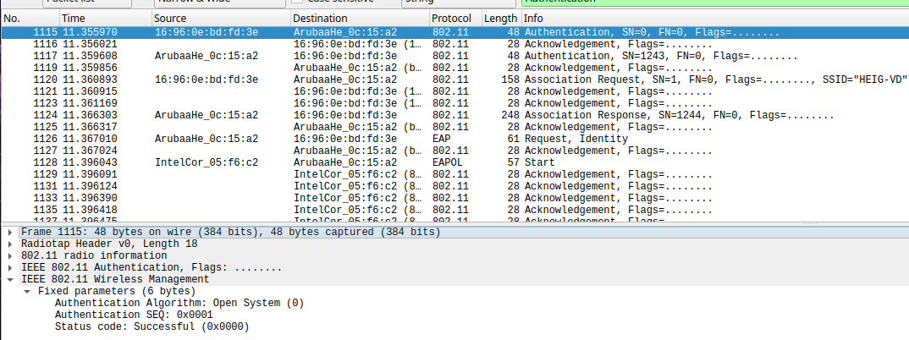

> Une fois l'authetification acceptée, la station demande à s'associer au réseau

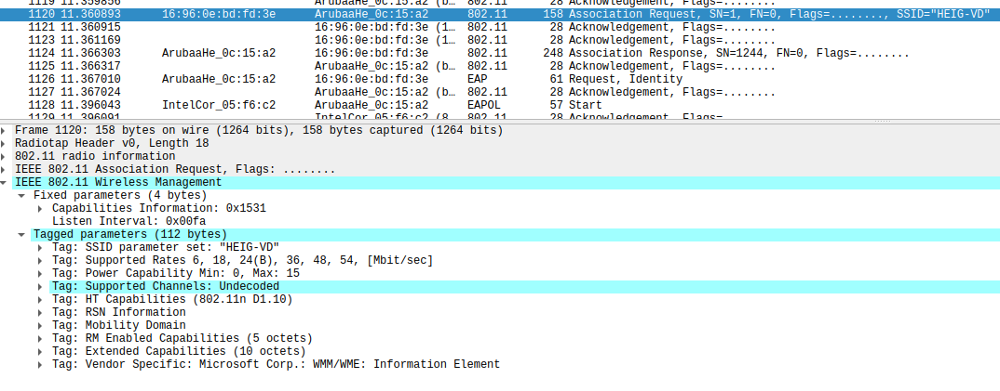

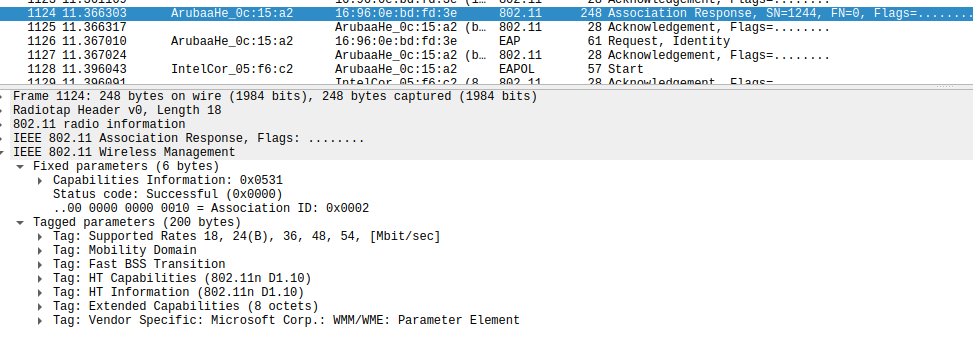

> A ce moment là entre en jeu le tunnel TLS avec la requête d'identité de la part du serveur, via l'AP

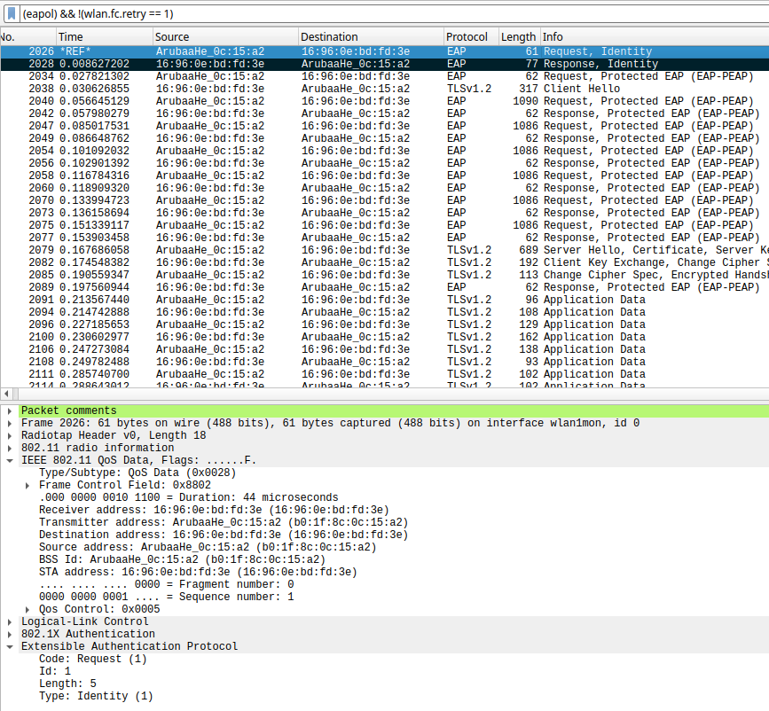

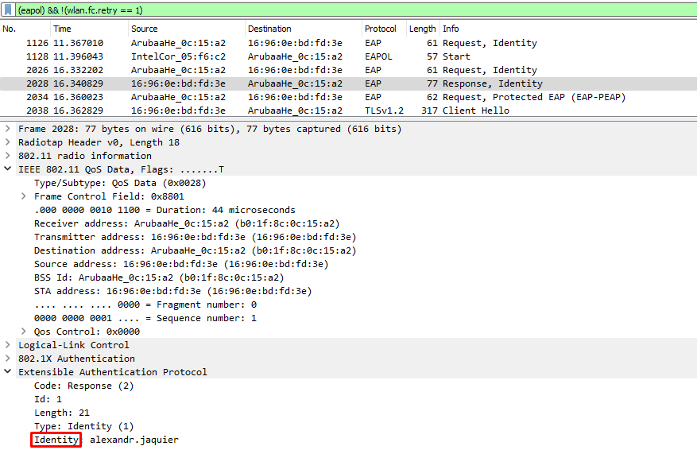

> On passe donc à la phase Hello avec l'échange des random, les algorithmes TLS et les identifiants de session de la part des deux parties

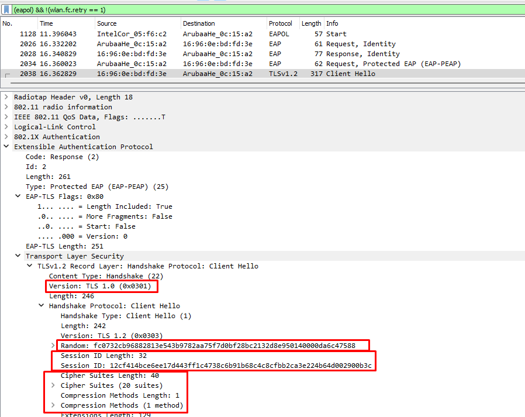

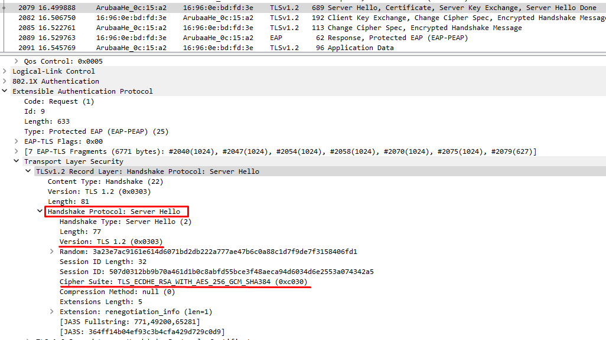

> Il y a ensuite la transmission de certificats. Comme il s'agit d'une session `PEAP` seul le serveur envoie son certificat, le client s'authentifiera de manière définitive après

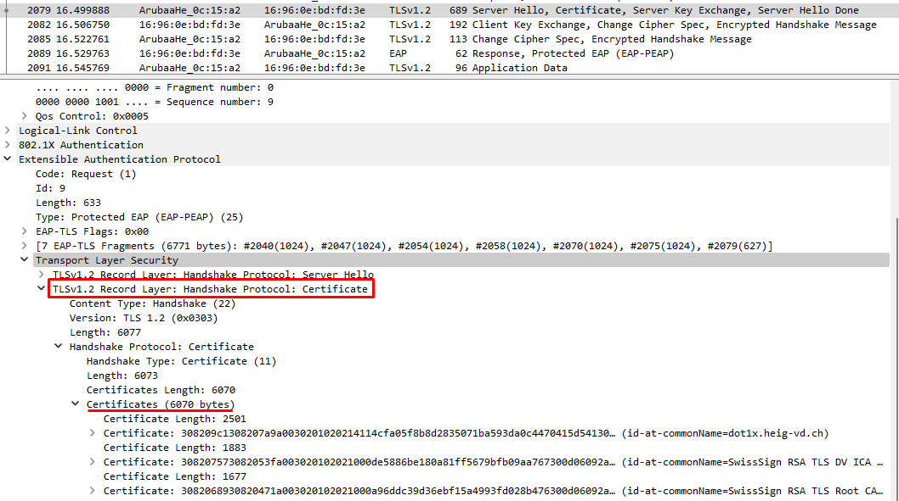

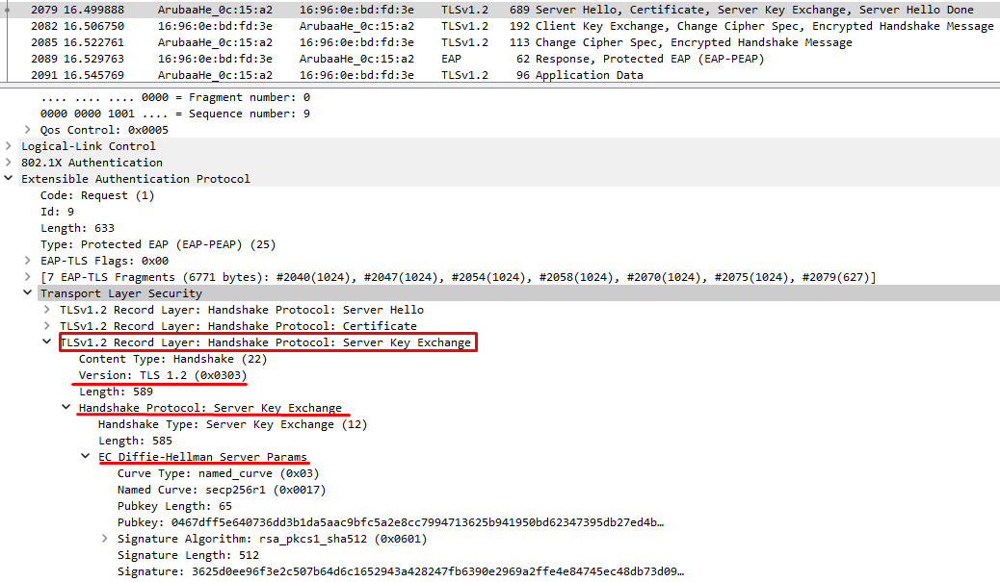

> Une fois les certificats validés et l'échange de clé effectué, les deux parties vont se mettre d'accord sur le *cipher* à utiliser pour la suite

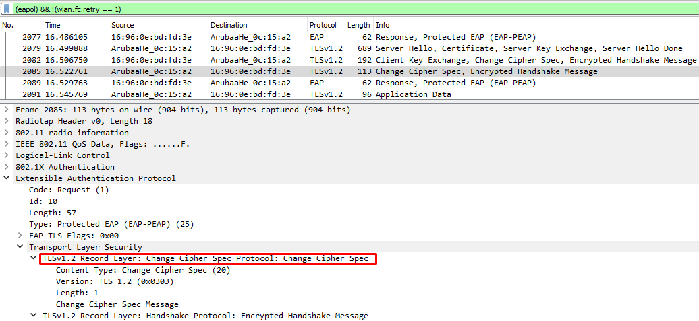

> A ce moment-là l'authentification entre le serveur d'authentification et la STA peut s'effectuer. On peut voir les trames passer mais comme elles sont encapsulées dans le tunnel TLS, on ne peut pas les lire

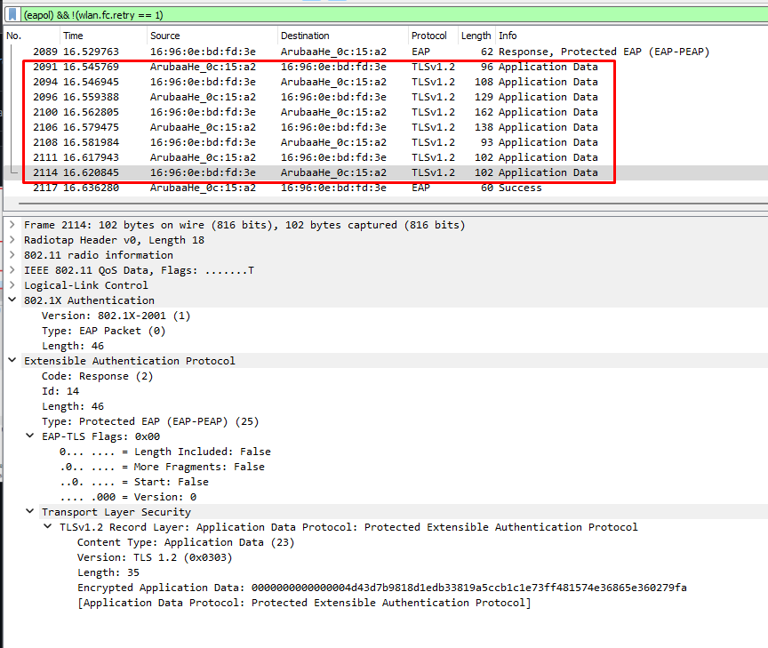

> Enfin le *4-way handshake* est effectué pour que la STA puisse s'authentifier auprès de l'AP et obtenir la clé de chiffrement WPA pour la suite des communications

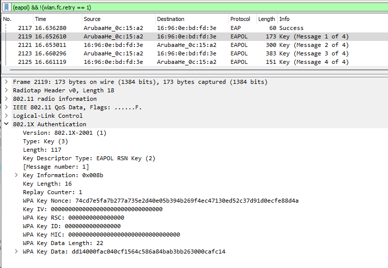

### Répondez aux questions suivantes :
 
> **_Question :_** Quelle ou quelles méthode(s) d’authentification est/sont proposé(s) au client ?
> 
> **_Réponse:_** La seule méthode d'authentification mise à disposition dans notre capture est "Protected EAP".

---

> **_Question:_** Quelle méthode d’authentification est finalement utilisée ?
> 
> **_Réponse:_**  Comme nous n'en avons qu'une seule, c'est celle-ci qui est utilisée.

---

> **_Question:_**Arrivez-vous à voir l’identité du client dans la phase d'initiation ? Oui ? Non ? Pourquoi ?
> 
> Oui, car en EAP le client s'identifie dès la phase d'initiation. L'identité du client est donc visible dans le paquet EAP-Response/Identity.

---

> **_Question:_** Lors de l’échange de certificats entre le serveur d’authentification et §§le client :
> 
> - a. Le serveur envoie-t-il un certificat au client ? Pourquoi oui ou non ?
> 
> **_Réponse:_** Oui, afin de prouver son identité, le serveur envoi 3 certificats au client. Ceci permet d'éviter les attaques de type `Man in the middle`
> 
> - b. Le client envoie-t-il un certificat au serveur ? Pourquoi oui ou non ?
> 
> **_Réponse:_** Non, dans la méthode EAP-PEAP, des identifiants sont utilisés et non des certificats.
> 

---

__ATTENTION__ : pour l'utilisation des deux outils suivants, vous __ne devez pas__ configurer votre interface en mode monitor. Elle sera configurée automatiquement par l'outil en mode AP.

### 2. Attaque WPA Entreprise (hostapd)

Les réseaux utilisant une authentification WPA Entreprise sont considérés aujourd’hui comme étant très surs. En effet, puisque la Master Key utilisée pour la dérivation des clés WPA est générée de manière aléatoire dans le processus d’authentification, les attaques par dictionnaire ou brute-force utilisés sur WPA Personnel ne sont plus applicables. 

Il existe pourtant d’autres moyens pour attaquer les réseaux Entreprise, se basant sur une mauvaise configuration d’un client WiFi. En effet, on peut proposer un « evil twin » à la victime pour l’attirer à se connecter à un faux réseau qui nous permette de capturer le processus d’authentification interne. Une attaque par dictionnaire ou même par brute-force peut être faite sur cette capture, beaucoup plus vulnérable d’être craquée qu’une clé WPA à 256 bits, car elle est effectuée sur le compte d’un utilisateur.

Pour faire fonctionner cette attaque, __il est impératif que la victime soit configurée pour ignorer les problèmes de certificats__ ou que l’utilisateur accepte un nouveau certificat lors d’une connexion. Si votre connexion ne vous propose pas d'accepter le nouveau certificat, faites une recherche pour configurer votre client pour ignorer les certificats lors de l'authentification.

Pour implémenter l’attaque :

- Installer [```hostapd-wpe```](https://www.kali.org/tools/hostapd-wpe/) (il existe des versions modifiées qui peuvent peut-être faciliter la tâche... je ne les connais pas mais si vous en trouvez une qui vous rend les choses plus faciles, vous pouvez l'utiliser et nous apprendre quelque chose ! Dans le doute, utiliser la version originale...). Lire la documentation [du site de l’outil](https://github.com/OpenSecurityResearch/hostapd-wpe), celle de Kali ou d’autres ressources sur Internet pour comprendre son utilisation
- Modifier la configuration de ```hostapd-wpe``` pour proposer un réseau semblable (mais pas le même !!!) au réseau de l’école ou le réseau de votre préférence, sachant que dans le cas d'une attaque réelle, il faudrait utiliser le vrai SSID du réseau de la cible
- Lancer une capture Wireshark
- Tenter une connexion au réseau (ne pas utiliser vos identifiants réels)
- Utiliser un outil de brute-force (```john```, ```hashcat``` ou ```asleap```, par exemple) pour attaquer le hash capturé (utiliser un mot de passe assez simple pour minimiser le temps)

> Voici le déroulement de l'attaque :
>
> 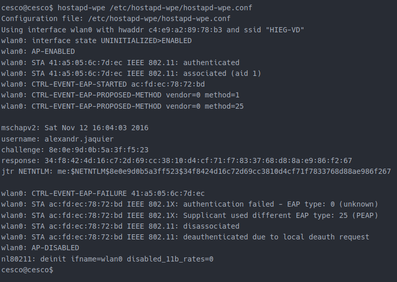
>
> Une fois le challenge/response récupéré nous pouvons essayer de le cracker avec `asleap` :
>
> 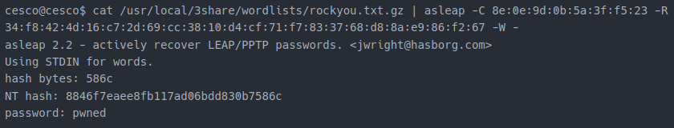

### Répondez aux questions suivantes :

> **_Question :_** Quelles modifications sont nécessaires dans la configuration de hostapd-wpe pour cette attaque ?
> 
> **_Réponse :_** Nous avons dû changé les champs `SSID` et `Channel` pour s'adapter au réseau que l'on veut imiter. Nous aurions également pu changer le champ `Interface` pour utiliser une interface différente de celle par défaut.

---

> **_Question:_** Quel type de hash doit-on indiquer à john ou l'outil que vous avez employé pour craquer le handshake ?
> 
> Dans notre cas, nous avons utilisé l'outil `asleap` qui ne requiert pas de type de hash. Mais si nous avions utilisé `john` ou `hashcat`, nous aurions dû indiquer le type de hash `NETNTLM` (-m 5500) comme indiqué par `hostapd-wpe` dans son output.

---

> **_Question:_** Quelles méthodes d’authentification sont supportées par hostapd-wpe ?
> 
> **_Réponse:_** Selon la doc, `hostpad-wpe` supporte un total de 6 méthodes d'authentification. Celles-ci sont les suivantes :

> * EAP-FAST/MSCHAPv2 (Phase 0)
> * PEAP/MSCHAPv2
> * EAP-TTLS/MSCHAPv2
> * EAP-TTLS/MSCHAP
> * EAP-TTLS/CHAP
> * EAP-TTLS/PAP

### 3. En option, vous pouvez explorer d'autres outils comme [eapeak](https://github.com/rsmusllp/eapeak) ou [crEAP](https://github.com/W9HAX/crEAP/blob/master/crEAP.py) pour les garder dans votre arsenal de pentester.

(Il n'y a pas de rendu pour cette partie...)

## Livrables

Un fork du repo original . Puis, un Pull Request contenant :

-	Captures d’écran + commentaires
-	Réponses aux questions

## Échéance

Le 1 juin 2023 à 23h59
